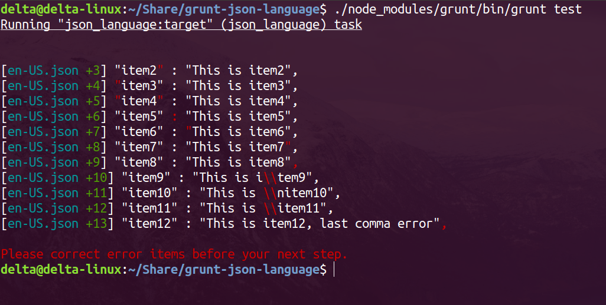

# grunt-json-language

> manage language json files, checking, unique keys, syncing, remove unused, pretty format and minimum file size

<font size=3 ><b>Expmple of checking json file</b></font>



## Getting Started
This plugin requires Grunt `~0.4.5` and Node.js `~8.0`

If you haven't used [Grunt](http://gruntjs.com/) before, be sure to check out the [Getting Started](http://gruntjs.com/getting-started) guide, as it explains how to create a [Gruntfile](http://gruntjs.com/sample-gruntfile) as well as install and use Grunt plugins. Once you're familiar with that process, you may install this plugin with this command:

  ```shell
  npm install grunt-json-language --save-dev
  ```

Once the plugin has been installed, it may be enabled inside your Gruntfile with this line of JavaScript:

  ```js
  grunt.loadNpmTasks('grunt-json-language');
  ```

## The "json_language" task

### Overview
In your project's Gruntfile, add a section named `json_language` to the data object passed into `grunt.initConfig()`.

  ```js
  grunt.initConfig({
	json_language: {
	  options: {
		// Task-specific options go here.
	  },
	  your_target: {
		// Target-specific file lists and/or options go here.
	  },
	},
  });
  ```

### Options

#### options.check
Type: `Boolean`
Default value: `true`

A option to define whether to check json format or not.

#### options.sync
Type: `Boolean`
Default value: `true`

A option to define whether to add language items which are not translated to multi languages or not.

#### options.unique
Type: `Boolean`
Default value: `false`

A option to define whether to make sure json keys are all unique or not.

#### options.rev_unused
Type: `Boolean`
Default value: `false`

A option to define whether to remove language items which are not used in project or not.

#### options.pretty
Type: `Boolean`
Default value: `false`

A option to define whether to pretty json format or not.

#### options.minimum
Type: `Boolean`
Default value: `false`

A option to define whether to remove space in json files or not.

#### options.www_out
Type: `String`
Default value: `'build/'`

A string value that is define where is web code.

#### options.eng_file
Type: `String`
Default value: `'en-US.json'`

A string value that is define what is name of English file.

#### options.ignore
Type: `Array`
Default value: `['languagesList.json']`

A string value that is define which files are not the language table.

### Usage Examples

#### Default Options
In this example, the default options are used to do something with whatever. So if the `testing` file has the content `Testing` and the `123` file had the content `1 2 3`, the generated result would be `Testing, 1 2 3.`

  ```js
  grunt.initConfig({
	json_language: {
	  options: {},
	  files: {
		'dest/default_options': ['src/testing', 'src/123'],
	  },
	},
  });
  ```

#### Custom Options
In this example, custom options are used to do something else with whatever else. So if the `testing` file has the content `Testing` and the `123` file had the content `1 2 3`, the generated result in this case would be `Testing: 1 2 3 !!!`

  ```js
  grunt.initConfig({
	json_language: {
	  options: {
		check: true,
		www_out: "build",
		ignore: ["languagesList.json"]
	  },
	  src: ["build/languages/*.json"]
	},
  });
  ```

## Contributing
In lieu of a formal styleguide, take care to maintain the existing coding style. Add unit tests for any new or changed functionality. Lint and test your code using [Grunt](http://gruntjs.com/).

## Release History
build 0.1.0 on 2017.10.15
